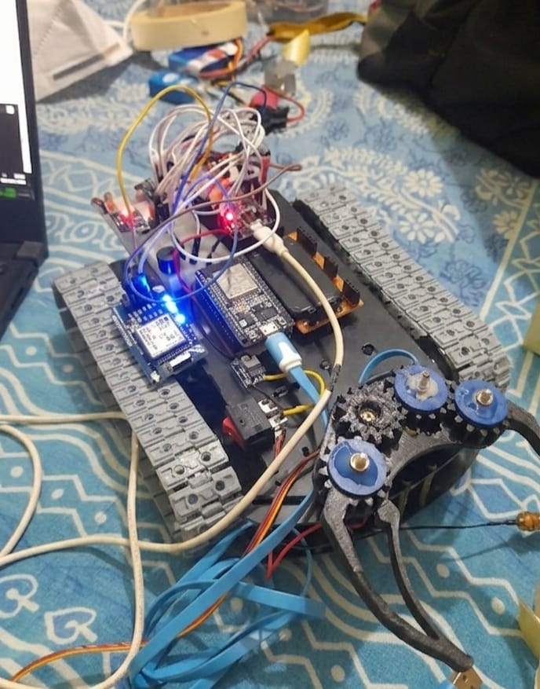
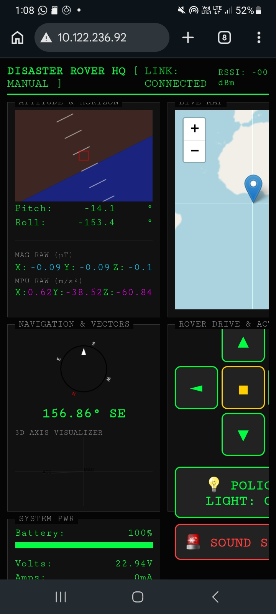
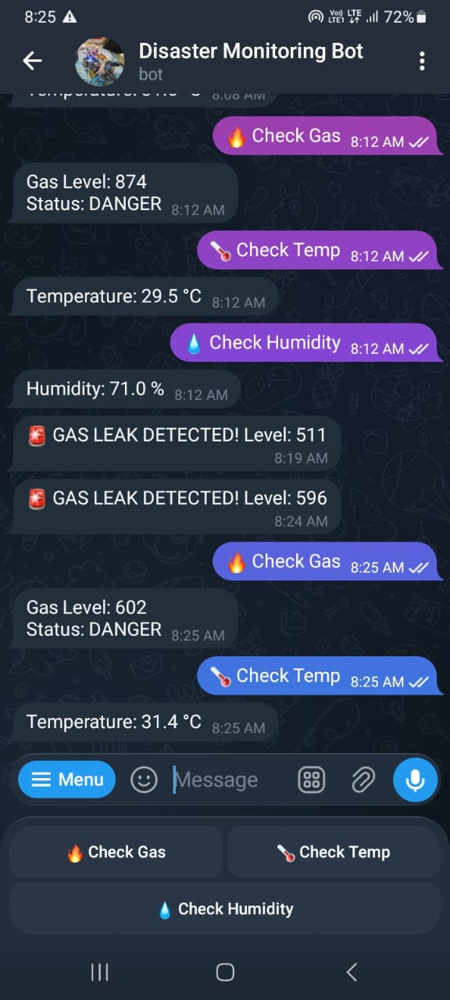
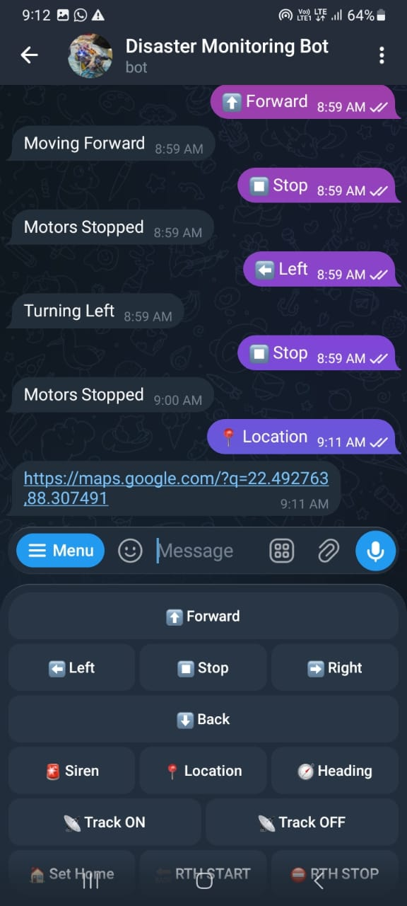
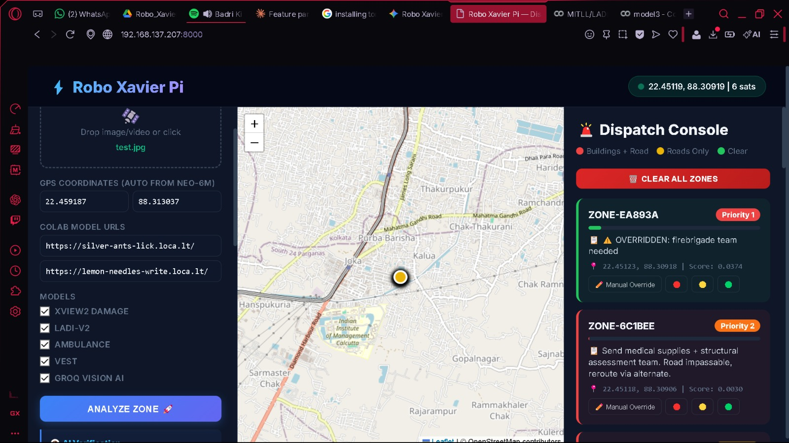
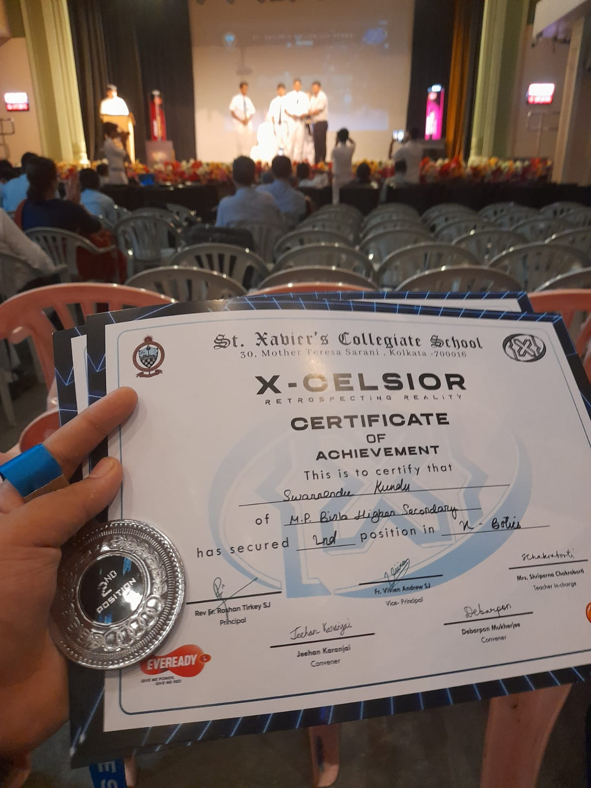

<div align="center">
  <!-- Animated Typing Title -->
  <a href="https://git.io/typing-svg"></a>
  
  <p>An autonomous, sensor-rich robotic vehicle for disaster response, environmental monitoring, and search & rescue operations.</p>

  
</div>

---

## 📖 Overview

The **Disaster Relief Tank** is an ESP32-powered, highly mobile robotic platform designed to operate in hazardous environments. It gathers critical real-time environmental data (temperature, gas, dust), tracks its location via GPS, and features an auto-return system to ensure recovery if connection is lost. The vehicle can be monitored via a dedicated dashboard and remotely controlled using a Telegram bot.

---

## ✨ Key Features

- **🌐 Remote Telemetry & Control:** Manage the vehicle and monitor sensor data remotely via a Telegram Bot.
- **🛰️ GPS & Auto-Return-to-Home (RTH):** Uses GNSS for precise location tracking. Auto-return logic safely guides the vehicle back to its starting point upon signal loss.
- **🌬️ Environmental Monitoring:** Equipped with DHT11/22 (Temp/Humidity), MQ-2 (Gas/Smoke), and Sharp Optical Dust sensors for real-time hazard assessment.
- **🧭 Advanced Navigation:** Integrated MPU6050 (IMU) and Magnetometer for accurate heading and orientation.
- **🔋 Power Management:** INA3221 voltage and current sensor for continuous battery and power distribution monitoring.

---

## 📸 Project Gallery

<div align="center">
  <table>
    <tr>
      <td align="center">
        <h3>💻 Dashboard View</h3>
        
      </td>
      <td align="center">
        <h3>📊 Sensor Monitor</h3>
        
      </td>
    </tr>
    <tr>
      <td align="center">
        <h3>📱 Telegram Integration</h3>
        
      </td>
      <td align="center">
        <h3>🤖 AI Webpage Interface</h3>
        
      </td>
    </tr>
  </table>
</div>

---

## 🏆 Awards & Recognition
<div align="center">
  
</div>

---

## 🛠️ Tech Stack

- **Microcontroller:** ESP32
- **Programming Languages:** C++ (Arduino IDE), Python
- **Navigation:** GPS (EVE L89), MPU6050, Magnetometer
- **Sensors:** DHT11/22, MQ-2, Sharp Optical Dust, INA3221
- **Communication:** Telegram Bot API, Serial Communication

---

## ⚡ Hardware Wiring Guide

This document outlines the pinout and wiring connections between the ESP32 microcontroller and the various environmental sensors, navigation modules, and motor drivers used in the system.

### 🌡️ Environmental Sensors

| Component | Sensor Pin | ESP32 Pin / Connection | Notes |
| :--- | :--- | :--- | :--- |
| **DHT11/22** | VCC | 3.3V | |
| | GND | GND | |
| | DATA | **GPIO 4** | Add a 10kΩ pull-up resistor between DATA and 3.3V if your sensor isn't on a breakout board. |
| **MQ-2 Gas** | VCC | 5V (VIN/VUSB) | Needs 5V for the heating element. |
| | GND | GND | |
| | AOUT | **GPIO 34 (ADC)** | **⚠️ Recommended:** Use a voltage divider to step 5V down to 3.3V. |
| **Optical Dust (Sharp)**| V-LED | 5V | Add a 150Ω resistor in series and a 220µF capacitor to GND as per the datasheet. |
| | LED-GND | GND | |
| | LED-IN | **GPIO 5** | This pin pulses the IR LED to take a reading. |
| | S-VCC | 5V | |
| | S-GND | GND | |
| | S-OUT | **GPIO 35 (ADC)** | **⚠️ Recommended:** Use a voltage divider to step 5V down to 3.3V. |

### 🧭 Navigation, IMU, Power & Motors

| Component | Pin / Function | ESP32 Connection | Notes |
| :--- | :--- | :--- | :--- |
| **EVE L89 (GNSS)** | TX | **GPIO 16 (RX2)** | We use Hardware Serial 2 for reliable GPS parsing. |
| | RX | **GPIO 17 (TX2)** | |
| | VCC | 3.3V | |
| | GND | GND | |
| **MPU6050 (IMU)** | SDA | **GPIO 21** | Standard I2C Data. |
| | SCL | **GPIO 22** | Standard I2C Clock. |
| **Magnetometer** | SDA | **GPIO 21** | Connect in parallel with the MPU6050 (I2C Bus). |
| | SCL | **GPIO 22** | Connect in parallel with the MPU6050 (I2C Bus). |
| **INA3221 (Power)** | SDA | **GPIO 21** | Connect in parallel with the MPU6050 (I2C Bus). |
| | SCL | **GPIO 22** | Connect in parallel with the MPU6050 (I2C Bus). |
| **Motor Driver** | IN1 (Left) | **GPIO 25** | Standard dual H-bridge (like L298N or TB6612). |
| | IN2 (Left) | **GPIO 26** | |
| | IN3 (Right)| **GPIO 27** | |
| | IN4 (Right)| **GPIO 14** | |

### ⚠️ Important Hardware Notes

#### 1. I2C Bus Configuration
The MPU6050, Magnetometer, and INA3221 all share the same I2C bus:
* **SDA:** GPIO 21
* **SCL:** GPIO 22
> **Note:** Ensure each device has a unique I2C address to avoid bus conflicts.

#### 2. Logic Level Protection (5V to 3.3V)
The ESP32 uses strict 3.3V logic. **Do not connect 5V output pins directly to ESP32 GPIOs.** As noted in the tables, use voltage dividers for 5V analog outputs (like the MQ-2 Gas Sensor and Sharp Optical Dust Sensor) to protect the ESP32's ADC pins (GPIO 34 and GPIO 35).

#### 3. Power Distribution
Sensors requiring 5V (MQ-2, Sharp Optical Dust) must be powered from the `VIN`/`VUSB` pin, assuming the ESP32 is powered via USB or a stable 5V regulator. Be cautious of the total current draw, especially when the MQ-2 heater is active.

---

## 🚀 Getting Started

### Prerequisites
- **Arduino IDE** (with ESP32 board manager installed)
- **Python 3.x** (for `gps_auto_return.py` and `auto_return.py` scripts)
- Required Arduino Libraries:
  - `DHT sensor library`
  - `Adafruit MPU6050`
  - `TinyGPS++`
  - `UniversalTelegramBot`
  - `Adafruit INA3221` (or equivalent)

### Installation & Setup
1. **Clone the repository:**
   ```bash
   git clone https://github.com/your-username/Disaster-Relief-Tank.git
   cd Disaster-Relief-Tank
   ```
2. **Flash the ESP32:**
   - Open `final-car.ino` or `car_with_telegram.ino` in Arduino IDE.
   - Update your Wi-Fi credentials and Telegram Bot Token inside the code.
   - Compile and upload to the ESP32.
3. **Run Python Scripts:**
   - For auto-return functionalities, connect the respective components and run the python scripts provided.
   ```bash
   python gps_auto_return.py
   ```

---

## 🤝 Contributing
Contributions, issues, and feature requests are welcome! Feel free to check the issues page.

## 📜 License
This project is licensed under the MIT License - see the LICENSE file for details.
